# Shiksha Copilot
## Overview

**Shiksha Copilot** is a transformative educational tool developed under the **VELLM (Universal Empowerment with Large Language Models)** initiative by Microsoft Research India. It is specifically designed to assist educators in streamlining and enriching the process of lesson planning and content creation. Shiksha Copilot acts as an intelligent assistant, empowering teachers to craft meaningful, engaging, and curriculum-aligned learning experiences tailored to the specific needs of their classrooms.

By allowing educators to select the exact curriculum, grade level, subject, and chapter they plan to teach, Shiksha Copilot provides a customized experience that aligns directly with their instructional goals. The system leverages advanced LLMs to generate a variety of pedagogically sound educational artifacts including:
- Detailed lesson plans
- Real-world examples that contextualize abstract concepts
- Analogies that bridge new ideas with familiar experiences
- Hands-on activities that promote experiential learning
- Formative and summative assessments for effective evaluation

Once teachers review and validate the generated content, the system automatically compiles it into user-friendly formats such as Microsoft Word (DOCX), PowerPoint (PPT), and student-friendly handouts. Furthermore, teachers can generate comprehensive question banks covering multiple chapters in alignment with standard educational blueprint formats. The system also features a conversational AI interface, enabling users to interact with Shiksha Copilot via natural language queries, ask textbook-related questions, or generate customized educational materials on the fly.

Please find additional details in [Shiksha-Copilot User FAQ](Transparency_FAQ_Shiksha-Copilot_latest.pdf)

## System Architecture

```mermaid
---
config:
  layout: elk
---
flowchart TB
    %% Offline Process
    subgraph OFFLINE["🔄 Offline Curriculum Processing"]
        A["Curriculum Textbooks"]
        A2["External Open Source Material"]
        B["Shiksha Ingestion"]
        B2["👨‍🎓 Curators"]
        A --> B
        A2 --> B
        B --> B2
    end
    
    %% Central Knowledge Base
    subgraph F["📚 Knowledge Base"]
        C["Vector Datastore"]
        D["Graph Datastore"] 
        E["Document Datastore"]
    end
    
    %% Online Process
    subgraph ONLINE["🌐 Online User Experience"]
        subgraph s1["Frontend"]
            G["Shiksha Website"]
        end
        
        subgraph H["Shiksha-API: FastAPI"]
            I["Lesson Chat"]
            J["Question Paper"]
            K["Edu Chat"]
        end
        
        subgraph M["Shiksha-API: Durable Functions"]
            N["Lesson Plan Generation"]
        end
        
        L["Bing Search API"]
    end
    
    %% Connections
    B2 --> F
    G -- SYNC --> H
    G -- ASYNC --> M
    I --> F
    J --> F
    K --> L

    M --> F
```

## Key Features
- **Multi-Source Content Ingestion:** Processes curriculum textbooks and external open-source educational materials through an intelligent [ingestion pipeline](shiksha-ingestion/) with human curator oversight for quality assurance.
- **Comprehensive Knowledge Base:** Maintains curriculum content across vector, graph, and document datastores enabling rich contextual retrieval and cross-referenced learning materials.
- **Curriculum-Aligned Content Creation:** Automatically generates lesson content strictly grounded in the curated knowledge base, enhancing relevance and coherence with educational standards and learning objectives.
- **Interactive Pedagogical Tools:** Supports the generation of multiple forms of educational content including interactive activities, analogies, real-world examples, and hands-on exercises to cater to diverse learner needs and teaching contexts.
- **Low-Resource Classroom Support:** Designed to empower educators in resource-constrained environments by providing comprehensive lesson planning tools, reducing preparation time, and ensuring access to quality educational materials regardless of infrastructure limitations.
- **Dual API Architecture:** Features both synchronous [FastAPI services](shiksha-api/app-service/) for real-time interactions and asynchronous [durable functions](shiksha-api/durable-functions/) for complex lesson plan orchestration.
- **Interactive Conversational Features:** 
  - **Lesson Chat:** Context-aware discussions about specific curriculum topics
  - **Question Paper Generator:** Structured assessment creation aligned with educational blueprints
  - **Edu Chat:** General educational queries enhanced with external web search capabilities
- **Full-Stack Web Application:** Complete [frontend](shiksha-website/shiksha-frontend/) and [backend](shiksha-website/shiksha-backend/) implementation for seamless user experience and robust server-side processing.
- **Deliverable Generation:** Converts validated lesson plans into readily usable classroom materials such as DOCX documents, PowerPoint slides, and student handouts.
- **Modular Architecture:** Offers independently usable components including:
  - Ingestion Pipeline with multiple processing engines (MinerU, SmolDocLing, OlmOCR)
  - LLM Task Queue (Deprecated)
  - Retrieval-Augmented Generation (RAG) Wrapper
  - Translation Model Training and Evaluation Toolkit

## Intended Use
- Empower educators across different regions and teaching contexts to create personalized, effective, and inclusive learning experiences.
- Accelerate the lesson planning workflow while maintaining high educational quality.
- Enhance the teacher’s role by freeing up time spent on content generation and enabling more focus on teaching delivery and student engagement.
- Provide researchers and developers access to modular and reusable components of the system to further innovation in education technology.

## Out-of-Scope Use
- Shiksha Copilot is **not intended** for commercial deployment or mission-critical applications without extensive validation.
- It should **not be used** in domains that require high-stakes decision-making such as healthcare, law enforcement, or finance, where inaccuracies can lead to serious consequences.
- It should also **not be applied** in any highly regulated environment unless the components have undergone necessary compliance checks and validations.
- The system is designed exclusively for teacher use with human oversight and is **not intended** for direct student interaction.

## Getting Started with Reusable Components
Shiksha Copilot follows a modular architecture with clear separation between offline content processing and online user services:

### Offline Content Processing
- **[Curriculum Ingestion](shiksha-ingestion/)** - Processes textbooks and external educational materials into structured knowledge
- **[Ingestion Pipeline Components](components/ingestion-pipeline/README.md)** - Core text extraction and processing engines
  - [MinerU Pipeline](components/ingestion-pipeline-mineru/README.md) - Advanced document processing
  - [SmolDocLing Pipeline](components/ingestion-pipeline-smoldocling/README.md) - Lightweight document processing  
  - [OlmOCR Pipeline](components/ingestion-pipeline-olmocr/README.md) - OCR-based text extraction

### Online User Services
- **[Shiksha Website Frontend](shiksha-website/shiksha-frontend/)** - React-based user interface
- **[Shiksha Website Backend](shiksha-website/shiksha-backend/)** - Server-side application logic
- **[Shiksha API Services](shiksha-api/app-service/)** - FastAPI endpoints for real-time interactions
- **[Durable Functions](shiksha-api/durable-functions/)** - Orchestrated lesson plan generation workflows

### Supporting Components
- **[RAG Wrapper](components/rag-wrapper/README.md)** - Retrieval-augmented generation interface
- **[LLM Queue](components/llm-queue/README.md)** -- Deprecated
- **Translation Toolkit:**
  - [Data Collection](components/translation/data_collection/README.md)
  - [Model Training](components/translation/training/README.md)  
  - [Inference Engine](components/translation/inference/README.md)

----
*Instructions for backend and frontend deployment of the entire Shiksha Copilot system, as well as individual modules, are provided in dedicated setup guides within the repository.*

## Evaluation
- We conducted extensive qualitative evaluations involving internal user testing teams and collaborated with educational partners such as the *Sikshana Foundation* to assess usability and utility in real-world classroom scenarios.
- **Azure Content Filtering Integration:** The system integrates Azure Content Filtering services to moderate both user inputs and generated outputs, ensuring educational appropriateness, factual correctness, and respectful communication across all interactions.
- **Human-in-the-Loop Quality Assurance:** The system incorporates human curators in the content ingestion pipeline to ensure educational quality and accuracy before materials enter the knowledge base.
- **Multi-Layer Content Filtering:** Beyond Azure services, the system employs additional content validation mechanisms and meta prompts to guide the language model toward generating only education-relevant and unbiased content.
- **Structured Knowledge Representation:** Content is stored across multiple datastore types (vector, graph, document) enabling comprehensive retrieval and cross-validation of educational materials.
- Ongoing system performance is tracked via anonymous telemetry available to the developers of the application.

## Limitations
- **Experimental Nature:** Shiksha Copilot is a research prototype and has not been extensively tested for production use. All usage should be under human supervision.
- **Content Dependency:** The quality of generated lessons is directly dependent on the curated knowledge base, which requires ongoing maintenance and updates by human curators.
- **Language Support:** Primarily tested on English-language inputs and outputs; support for other languages is experimental and should be used cautiously.
- **Model Limitations:** Outputs from large language models may occasionally include hallucinated facts, speculative content, or biased information. It is crucial that educators carefully review and validate the content before classroom use.
- **Content Accuracy:** The AI-generated content may contain occasional errors or inaccuracies. Users of Shiksha Copilot should thoroughly validate all content before incorporating it into their classroom teaching materials.
- **Model Dependency:** The quality and reliability of outputs are inherently tied to the underlying model. Shiksha Copilot currently utilizes the GPT-4o model.
- **Infrastructure Requirements:** The system requires multiple components (knowledge base, API services, web application) to be properly deployed and maintained for full functionality.
- **Security:** Developers deploying the tool in open environments must implement/use appropriate security mechanisms like Azure's content moderation.

## Best Practices
- Choose model configurations that best suit your application's context—larger models for general-purpose generation or smaller fine-tuned models for domain-specific tasks.
- Leverage platforms like **Azure OpenAI (AOAI)** that incorporate state-of-the-art safety features and Responsible AI (RAI) policies. Learn more from:
  - [Responsible AI Features in AOAI](https://techcommunity.microsoft.com/t5/ai-azure-ai-services-blog/announcing-new-ai-safety-amp-responsible-ai-features-in-azure/ba-p/3983686)
  - [Azure OpenAI Responsible AI Overview](https://learn.microsoft.com/en-us/legal/cognitive-services/openai/overview)
  - [Azure OpenAI Transparency Note](https://learn.microsoft.com/en-us/legal/cognitive-services/openai/transparency-note)
  - [OpenAI’s Usage Policies](https://openai.com/policies/usage-policies)
  - [Azure OpenAI Code of Conduct](https://learn.microsoft.com/en-us/legal/cognitive-services/openai/code-of-conduct)
- Ensure ethical and legal sourcing of datasets—obtain proper consent, anonymize personally identifiable data, and secure usage rights for all media or textual content.
- Review privacy, consent, and data usage policies for all components interacting with Shiksha Copilot, including storage and retrieval systems.
- Comply with local and international data protection regulations (e.g., GDPR, FERPA) when deploying this tool in real-world settings.

## Trademarks
This repository may contain references to Microsoft trademarks, products, or services. Use of Microsoft trademarks must follow the official [Trademark & Brand Guidelines](https://www.microsoft.com/en-us/legal/intellectualproperty/trademarks/usage/general). Unauthorized or misleading use of trademarks, including those of third parties, is prohibited.

## Privacy & Ethics
Shiksha Copilot is developed with a strong commitment to privacy-by-design principles and ethical considerations in educational technology:

### Data Privacy
- All user interactions with Shiksha Copilot are treated with strict confidentiality and data minimization practices.
- No personally identifiable information (PII) is stored in the system, and none is required for any of its features to work.
- No educational content generated by AI or edited by teachers is stored in our systems.
- Anonymous telemetry collects only system performance metrics and does not track individual user behavior or content.

### Ethical AI Principles
- **Transparency**: We clearly communicate the capabilities and limitations of the system to users.
- **Fairness**: Content generation algorithms are regularly audited for potential biases across different cultural contexts, subjects, and pedagogical approaches.
- **Inclusivity**: The system is designed to support diverse learning needs and perspectives, with ongoing improvements to enhance accessibility.
- **Agency and Oversight**: Teachers maintain complete editorial control over generated content, reinforcing their critical role in educational decision-making.

### Educational Content Ethics
- Content is generated with age-appropriateness in mind from the beginning, rather than applying filtering post-generation. Users can implement their own additional filters if necessary.
- The system incorporates safeguards against generating harmful, misleading, or culturally insensitive content.

### Research Ethics
- Any research conducted using anonymized data follows established ethical guidelines for educational research.
- If deployed in research contexts, proper informed consent is obtained from all participants, with clear explanation of data usage.
- Research findings are transparently reported, including both positive outcomes and limitations.

### Governance
- An internal ethics review process evaluates potential applications and deployment contexts.
- Regular audits assess the system's adherence to these ethical principles and identify areas for improvement.
- We actively seek input from educational experts, ethicists, and stakeholders to continuously refine our approach.

By prioritizing these principles, we aim to ensure that Shiksha Copilot serves as a responsible tool that empowers educators while respecting their autonomy, protecting user privacy, and advancing equitable educational outcomes.

## Contact
We welcome feedback and collaboration from our audience. If you have suggestions, questions, or observe unexpected/offensive behavior in our technology, please contact us at *kchourasia@microsoft.com*.
If the team receives reports of undesired behavior or identifies issues independently, we will update this repository with appropriate mitigations.

## Contributing

This project welcomes contributions and suggestions.  Most contributions require you to agree to a
Contributor License Agreement (CLA) declaring that you have the right to, and actually do, grant us
the rights to use your contribution. For details, visit https://cla.opensource.microsoft.com.

When you submit a pull request, a CLA bot will automatically determine whether you need to provide
a CLA and decorate the PR appropriately (e.g., status check, comment). Simply follow the instructions
provided by the bot. You will only need to do this once across all repos using our CLA.

This project has adopted the [Microsoft Open Source Code of Conduct](https://opensource.microsoft.com/codeofconduct/).
For more information see the [Code of Conduct FAQ](https://opensource.microsoft.com/codeofconduct/faq/) or
contact [opencode@microsoft.com](mailto:opencode@microsoft.com) with any additional questions or comments.

## Legal Notices
Microsoft and any contributors grant you a license to the code in this repository under the MIT License. For more details, see the [LICENSE](LICENSE) file.

Microsoft, Windows, Microsoft Azure, and/or other Microsoft products and services referenced in the documentation may be either trademarks or registered trademarks of Microsoft in the United States and/or other countries. The licenses for this project do not grant you rights to use any Microsoft names, logos, or trademarks. Microsoft's general trademark guidelines can be found at http://go.microsoft.com/fwlink/?LinkID=254653.

Privacy information can be found at https://go.microsoft.com/fwlink/?LinkId=521839

Microsoft and any contributors reserve all other rights, whether under their respective copyrights, patents, or trademarks, whether by implication, estoppel, or otherwise.

