# Shiksha Copilot Durable Functions

A serverless Azure Functions application that generates educational lesson plans using AI-powered orchestration. This application leverages Azure Durable Functions to manage complex, long-running lesson plan generation workflows with status tracking and webhook notifications.

## Architecture Overview

The application consists of the following components:

- **HTTP Trigger** (`LessonPlanHttpTrigger`): REST API endpoint for lesson plan generation requests
- **Orchestrator** (`LessonPlanOrchestrator`): Manages the workflow execution and coordinates activities
- **Activities**:
  - `GenerateSectionActivity`: Generates individual lesson plan sections
  - `SectionsGraphOrchestrator`: Manages section dependencies and execution order
  - `WebhookStatusActivity`: Sends status updates to external webhooks

## Features

- **Asynchronous Processing**: Long-running lesson plan generation with status tracking
- **Workflow Orchestration**: Complex dependency management between lesson plan sections
- **AI-Powered Content**: Integration with Azure OpenAI for intelligent content generation
- **Multiple RAG Strategies**: Support for both vector-based and graph-based retrieval-augmented generation
- **Status Webhooks**: Real-time status updates via HTTP callbacks
- **Containerized Deployment**: Docker support for consistent deployments
- **Parallel RAG Execution**: Optimized section generation through parallel execution of independent RAG operations

## RAG Agent Strategies

The system supports multiple Retrieval-Augmented Generation (RAG) strategies for content generation, including:


### Qdrant RAG Agent (`QdrantRAGAgent`)

- **Strategy**: Uses Qdrant vector database for scalable, production-grade vector search and retrieval
- **Implementation**: Integrates with `QdrantRagOps` for querying Qdrant collections
- **Best for**: Large-scale, high-performance semantic search and retrieval tasks
- **How it works**:
   - The agent parses the `index_path` to determine the Qdrant collection and metadata filter
   - Uses Azure OpenAI for both embedding and completion
   - Queries Qdrant for relevant content using vector similarity and metadata filtering
   - Handles structured JSON responses and robust error handling

### Vector Index RAG Agent (Data store- Azure Blob) (`VectorIndexRAGAgent`)

- **Strategy**: Traditional vector-based retrieval using similarity search
- **Implementation**: Uses `InMemRagOps` from the rag-wrapper library
- **Best for**: General content retrieval and similarity-based matching
- **How it works**:
  - Documents are converted to vector embeddings
  - Queries are embedded and matched against document vectors using cosine similarity
  - Most relevant content is retrieved based on semantic similarity


### Graph Index RAG Agent (Data store- Azure Blob) (`GraphIndexRAGAgent`)

- **Strategy**: Property graph-based retrieval with entity and relationship awareness
- **Implementation**: Uses `InMemGraphRagOps` from the rag-wrapper library
- **Best for**: Complex reasoning requiring understanding of relationships between concepts
- **How it works**:
  - Extracts entities and relationships from documents to create a knowledge graph
  - Enables sophisticated reasoning over interconnected concepts
  - Supports complex queries that require understanding of entity relationships


#### RAG agents with Azure blob as data store inherit `BaseAzureBlobRAGAgent` which provides:

- Azure OpenAI integration with structured JSON response formatting
- Blob storage management for downloading and caching RAG indexes
- Resource cleanup and error handling

## Agent Pool

The `AgentPool` class manages singleton instances of all agent types, ensuring efficient resource usage and consistent access throughout the application.

- **Purpose**: Centralized factory and cache for all agent instances (GPT, RAG, Validator, etc.)
- **Features**:
   - Prevents duplicate instantiation of agents
   - Supports multiple RAG agent types (Qdrant, Vector, Graph) based on identifier
   - Provides methods to clear and reset agent resources
- **Usage**:
   - `AgentPool.get_rag_agent(identifier)`: Returns the correct RAG agent instance for the given index/identifier
   - `AgentPool.get_gpt_agent()`: Returns the singleton GPT agent
   - `AgentPool.clear_rag_agent_resources(identifier)`: Clears resources for a specific RAG agent

## Lesson Plan Creation Flow

The lesson plan generation follows a sophisticated workflow orchestration pattern using Directed Acyclic Graphs (DAGs) for optimal parallel execution:


### Key Classes and Components

#### Core Orchestration Classes

- **`LessonPlanOrchestrator`**: Main orchestrator managing the overall workflow
- **`SectionsGraphOrchestrator`**: Sub-orchestrator handling parallel section generation
- **`DAG`**: Directed Acyclic Graph implementation for dependency management
- **`AgentPool`**: Singleton factory for managing agent instances

#### Generation Agents


- **`BaseAzureBlobRAGAgent`**: Abstract base class for RAG agents
- **`QdrantRAGAgent`**: Qdrant vector database-based content retrieval (see details above)
- **`VectorIndexRAGAgent`**: Vector similarity-based content retrieval
- **`GraphIndexRAGAgent`**: Knowledge graph-based content retrieval
- **`GPTAgent`**: Direct GPT-based content generation
- **`ValidatorAgent`**: Content validation and quality assurance

#### Agent Management

- **`AgentPool`**: Singleton factory and manager for all agent instances (see details above)

#### Data Models

- **`WorkflowDefinition`**: Defines the lesson plan structure and dependencies
- **`SectionDefinition`**: Individual section configuration and requirements
- **`RAGInput`**: Input parameters for RAG-based generation
- **`GPTInput`**: Input parameters for GPT-based generation
- **`LessonPlanGenerationInput`**: Complete input for lesson plan generation

#### Query Generation

- **`QueryGenerator`**: Creates optimized prompts for initial generation
- **`RegenQueryGenerator`**: Handles regeneration with user feedback integration

## Workflow Orchestration & Parallel Execution

The system uses a **Directed Acyclic Graph (DAG)** to optimize lesson plan generation through parallel execution of independent sections.

### DAG Creation & Execution Flow

#### 1. Initial DAG Creation


**Example 5E Instructional Model Workflow DAG:**


#### 2. Parallel Execution Strategy

```mermaid
graph LR
    subgraph "Subgraph Parallelism"
        A[Subgraph 1: Engage → Explore → Explain → Elaborate] --> C[Checklist]
        B[Subgraph 2: Evaluate] --> C
    end
```



Within subgraphs, if multiple nodes are NOT waiting for any of their parent dependencies to be generated, they are processed in parallel as well.

#### 3. Regeneration Scenario with User Feedback

When regenerating with user feedback, previously generated sections are added as **completed dependency nodes** to existing workflow nodes:

```mermaid
graph TD
    UF["User Feedback: 'Change the starting scenario'"] -.-> B
    
    subgraph "Previous Content (Completed)"
        A["other_section_engage: ✓"]
        C["other_section_explore: ✓"]
        E["other_section_explain: ✓"]
        G["other_section_elaborate: ✓"]
        I["other_section_evaluate: ✓"]
    end
    
    subgraph "Sequential Regeneration Chain"
        B["section_engage: Regenerate"]
        D["section_explore: Regenerate"]
        F["section_explain: Regenerate"]
        H["section_elaborate: Regenerate"]
        J["section_elvaluate: Regenerate"]
        L["section_checklist: Regenerate"]
    end
    
    subgraph "Final Output"
        M["Complete Regenerated Lesson Plan"]
    end
    
    A --> B
    B --> D
    C --> D
    
    D --> F
    E --> F
    
    F --> H
    G --> H
    H --> J
    I --> J
    J --> L
    L --> M
```



**How It Works:**

1. Each previous section becomes "other\_[section_id]" dependency node (COMPLETED)
2. Original workflow nodes get these "other\_" nodes as additional dependencies
3. LLM receives: previous content + user feedback + current parent sections
4. Only nodes requiring regeneration are executed (not already COMPLETED ones)
5. Parallel execution: [section_engage] || [section_evaluate] can run simultaneously

## API Endpoints

📋 **For complete API documentation with detailed request/response examples, see [APIContract.md](./APIContract.md)**

### Generate Lesson Plan

- **Endpoint**: `POST /api/v2/lesson-plans/`
- **Description**: Starts asynchronous lesson plan generation
- **Response**: Returns orchestration instance ID and status URLs

### Generate Checklist (Synchronous)

- **Endpoint**: `POST /api/v2/lesson-plans/checklist`
- **Description**: Generates a checklist synchronously with immediate response
- **Response**: Returns generated checklist content

## Prerequisites

- Python 3.11
- Poetry (for dependency management)
- Azure CLI (for deployment)
- Docker (for containerized deployment)
- Azure subscription with the following services:
  - Azure Functions (Premium or Dedicated plan recommended)
  - Azure Storage Account
  - Azure Container Registry (optional, for container deployment)
  - Azure OpenAI Service or OpenAI API access

## Local Development

### Setup

1. **Install dependencies**

   ```bash
   poetry install
   ```

2. **Configure environment variables**
   Copy `local.settings.json.example` to `local.settings.json` and update with your values:

   ```json
   {
     "IsEncrypted": false,
     "Values": {
       "AzureWebJobsStorage": "your-storage-connection-string",
       "FUNCTIONS_WORKER_RUNTIME": "python",
       "AZURE_OPENAI_API_BASE": "your-openai-endpoint",
       "AZURE_OPENAI_API_KEY": "your-openai-key",
       "AZURE_OPENAI_API_VERSION": "2024-08-01-preview",
       "AZURE_OPENAI_MODEL": "gpt-4o",
       "AZURE_OPENAI_EMBED_MODEL": "text-embedding-ada-002",
       "BLOB_STORE_CONNECTION_STRING": "your-blob-storage-connection-string",
       "WEBHOOK_URL": "your-webhook-endpoint"
     }
   }
   ```

3. **Run locally**
   ```bash
   func start
   ```

## Deployment

### Container Deployment

1. **Build and push container**

   ```bash
   # Login to Azure Container Registry
   az acr login --name your-registry-name

   # Build and push
   docker build -t your-registry.azurecr.io/shiksha-functions:latest .
   docker push your-registry.azurecr.io/shiksha-functions:latest
   ```

2. **Create Azure function app**: Follow the Azure documented steps [here](https://learn.microsoft.com/en-us/azure/azure-functions/functions-how-to-custom-container?tabs=core-tools%2Cacr%2Cazure-cli2%2Cazure-cli&pivots=azure-functions#azure-portal-create-using-containers)

## Environment Variables

Configure the following environment variables in your Azure Function App:

### Environment Variables

| Variable                       | Description                                          | Example / Default                                |
| ------------------------------ | ---------------------------------------------------- | ------------------------------------------------ |
| `AzureWebJobsStorage`          | Azure Storage connection string for function runtime | `DefaultEndpointsProtocol=https;AccountName=...` |
| `FUNCTIONS_WORKER_RUNTIME`     | Function runtime                                     | `python`                                         |
| `AZURE_OPENAI_API_BASE`        | Azure OpenAI service endpoint                        | `https://your-openai.openai.azure.com`           |
| `AZURE_OPENAI_API_KEY`         | Azure OpenAI API key                                 | `your-api-key`                                   |
| `AZURE_OPENAI_API_VERSION`     | OpenAI API version                                   | `2024-08-01-preview`                             |
| `AZURE_OPENAI_MODEL`           | Primary GPT model                                    | `gpt-4o`                                         |
| `AZURE_OPENAI_EMBED_MODEL`     | Embedding model                                      | `text-embedding-ada-002`                         |
| `BLOB_STORE_CONNECTION_STRING` | Blob storage for content artifacts                   | `DefaultEndpointsProtocol=https;AccountName=...` |
| `WEBHOOK_URL`                  | Webhook endpoint for status updates                  | `None`                                           |
| `BLOB_STORE_URL`               | Public blob storage URL                              | `None`                                           |
| `AzureWebJobsFeatureFlags`     | Enable worker indexing                               | `EnableWorkerIndexing`                           |

### Setting Environment Variables

```bash
# Using Azure CLI
az functionapp config appsettings set --name shiksha-functions --resource-group shiksha-rg --settings "AZURE_OPENAI_API_KEY=your-key"

# Using Azure Portal
# Navigate to Function App > Configuration > Application settings
```

## Security Considerations

- Use Azure Key Vault for sensitive configuration values
- Enable Managed Identity for secure access to Azure resources
- Implement proper authentication for webhook endpoints
- Review and limit function app permissions
- Enable HTTPS-only traffic
